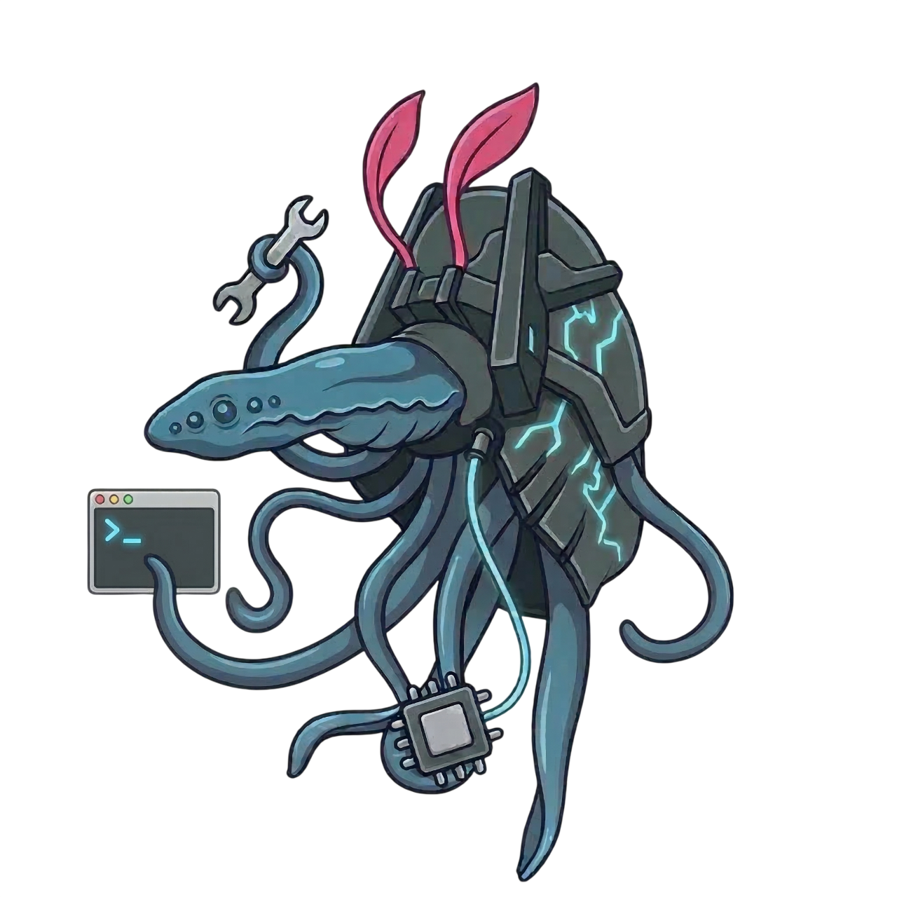

<p align="center">
  
</p>

<h1 align="center">huragok</h1>

<p align="center">
  A CLI tool for AI-powered 3D asset generation.<br>
  Named after the <a href="https://www.halopedia.org/Huragok">Huragok</a> (Engineers) from the Halo game series, creatures that can "fabricate complex objects seemingly out of thin air".
</p>

huragok wraps the fragmented workflow of going from a text description to a game-ready 3D model into a single, reproducible pipeline. It works interactively at the terminal, or headlessly as part of an AI agent or CI workflow.

---

## Quick start

### 1. Set environment variables

```bash
export HURAGOK_OPENAI_KEY="sk-..."
export HURAGOK_HUNYUAN_SECRET_ID="..."
export HURAGOK_HUNYUAN_SECRET_KEY="..."
```

### 2. Build

```bash
go build ./cmd/huragok/
```

### 3. Run

```bash
./huragok create "futuristic sci-fi cargo crate, metal panels with glowing blue indicators, game prop" --output my_asset.glb
```

The pipeline runs automatically: concept image (~12s) → 3D model (~1-2 min) → .glb file.

### Content filter note

OpenAI's DALL-E 3 blocks certain terms. Avoid: "pistol", "gun", "rifle", "weapon". Use instead: "sidearm", "handgun prop", "blaster prop", "energy device", "game asset". The tool retries automatically up to 3 times on content filter false positives.

---

## Demo walkthrough

Step-by-step guide for demoing huragok live.

### Before the demo

1. Open a terminal in the huragok project directory
2. Make sure env vars are exported (see Quick start above)
3. Have a browser tab open with [glTF Viewer](https://gltf-viewer.donmccurdy.com/) for showing results
4. Have a browser tab open with the [GitHub repo](https://github.com/jorgoose/huragok) as reference

### Run the demo

**Step 1 — kick off the pipeline.** Type the command and hit enter:

```bash
./huragok create "sci-fi sidearm, compact futuristic handgun prop, sleek angular design, matte gray with blue energy accents, game asset" --output demo_sidearm.glb
```

The audience sees:
```
  ● HURAGOK — 3D Asset Pipeline

  Prompt:  sci-fi sidearm, compact futuristic handgun prop...

  ▸ Generating concept image... done (13.3s)
    Saved → .huragok\concept.png
```

**Step 2 — talk while Hunyuan3D generates (~1-2 min).** Explain what's happening:
- "This is huragok — a Go CLI that wraps the full text-to-3D pipeline into one command"
- "Step 1 just happened — sent the prompt to DALL-E 3 and got a concept image back"
- "Step 2 is running now — that image was sent to Tencent's Hunyuan3D API which generates a textured 3D mesh from it"
- "The tool is designed to be called by AI coding agents — Claude Code can invoke it as a skill to generate game assets on the fly"
- "Built in Go for instant startup and single-binary distribution"

**Step 3 — model lands.** Terminal shows completion:
```
  ▸ Generating 3D model via Hunyuan3D... done (1m5s)
    Raw model: 10.3 MB

  ✓ Output → demo_sidearm.glb (10.3 MB)
```

**Step 4 — show the result.** Drag `demo_sidearm.glb` into the glTF Viewer browser tab. Rotate the model, zoom in, show the textures.

**Step 5 (optional) — show the concept image.** Open `.huragok/concept.png` to show the intermediate DALL-E 3 image that produced the 3D model.

### If something goes wrong

- **Content filter blocks the prompt** — the tool auto-retries up to 3 times. If all fail, rephrase using safer terms (see content filter note above)
- **Hunyuan3D times out** — run it again
- **Billing error** — check that API credits exist on both OpenAI and Tencent Cloud

### Alternative demo prompts

```bash
# Cargo crate
"futuristic sci-fi cargo crate, metal panels with glowing blue indicators, weathered surface, game prop"

# Alien artifact
"ancient alien artifact, glowing runes, crystalline structure, mysterious game prop"

# Military container
"military supply container, olive drab, stenciled markings, industrial game prop"

# Sci-fi helmet
"futuristic combat helmet, angular visor, matte black with blue accents, game asset"
```

---

## Usage scenarios

### "I need a gun model for my game"

You're building an FPS and need a rifle model. You don't have a 3D artist.

```bash
$ huragok create "futuristic assault rifle, angular design, matte black with blue accents"
```

huragok refines your prompt, shows you what it came up with — you approve it. It generates concept art — a clean side-view of the rifle. Looks good, you accept. It sends that to Hunyuan3D, waits about a minute, and drops a 48k-face mesh on disk. You inspect it in the review UI (`huragok review`), approve, and it decimates it down to 8k faces and writes `static/assault_rifle.glb`. Total time: ~2 minutes. Cost: ~$0.15.

### "Claude, add a new prop to the arena"

You're working in Claude Code on your game project. You tell Claude you want a new asset. Claude knows about the `huragok` skill, so it runs:

```bash
huragok create "alien energy blade, glowing plasma edge, ornate hilt, fantasy game prop" \
  --output static/energy_blade.glb
```

Claude waits for the pipeline to complete (~2 minutes), confirms the .glb was generated, then wires it into the game code — imports the GLB, adds it to the scene, and sets up the logic. You never left your editor.

`huragok` ships with a [Claude Code skill file](skills/huragok.md) that teaches Claude when and how to invoke the CLI, including prompt guidelines and content filter workarounds. Copy it to your project's `.claude/skills/` directory to enable this workflow.

### "The crate model looks bad, I want to try a different provider"

You generated a cargo crate last week. The shape was fine but the textures were muddy. Your concept art was great though — you don't want to redo that.

```bash
$ huragok runs
  2026-03-10_cargo_crate_a3f8   complete   hunyuan3d/pro   $0.14
  2026-03-12_plasma_rifle_b7c2  complete   hunyuan3d/pro   $0.16

$ huragok resume 2026-03-10_cargo_crate_a3f8 --from model3d --provider meshy
```

It picks up the existing concept art, sends it to Meshy instead of Hunyuan, and runs post-processing on the new mesh. The concept art wasn't regenerated, so you only paid for one 3D generation call. At scale, this kind of selective re-run adds up — skipping redundant stages across dozens of assets can significantly reduce API costs.

### "I have sketches from my artist, turn them into models"

Your concept artist drew reference sheets for five weapons. You want 3D models from those drawings.

```bash
$ huragok create --from ./sketches/shotgun_front.png ./sketches/shotgun_side.png \
    --output static/shotgun.glb
```

Skips prompt refinement and image generation entirely. Goes straight from your artist's images into 3D generation.

### "I need to batch-generate props for a whole level"

You have a list of environment props you need. You write a simple script:

```bash
#!/bin/bash
assets=(
  "metal storage locker, military, dented:storage_locker"
  "wall-mounted terminal screen, sci-fi:wall_terminal"
  "fluorescent ceiling light panel, industrial:ceiling_light"
  "fire extinguisher, futuristic design:extinguisher"
)

for entry in "${assets[@]}"; do
  prompt="${entry%%:*}"
  name="${entry##*:}"
  huragok create "$prompt" --auto --output "static/${name}.glb" --json
done
```

Runs headlessly, generates all four assets unattended. Check the results in the review UI afterward.

### "I want to review everything from today's generation session"

You generated a handful of assets throughout the day. You want to review them all, compare variants, and decide which to keep.

```bash
$ huragok review
```

Opens a local web dashboard in your browser. You see all today's runs, can rotate and inspect each 3D model, compare side-by-side, view the concept art that produced each one, and check costs.

---

## Review UI

The terminal is fine for approving prompts and kicking off generation, but reviewing images and 3D models requires actual visual inspection. huragok includes an optional local web dashboard for this.

```bash
# Open the review UI for all runs
huragok review

# Open a specific run
huragok review 2026-03-10_cargo_crate_a3f8
```

This launches a lightweight local server and opens your browser. No Electron, no install — just a local page.

### What you can do in the review UI

**Run timeline** — browse all past runs chronologically, filter by status, search by prompt.

**Image gallery** — view generated concept art at full resolution. Compare multiple generations side by side. Zoom, pan, check details.

**3D model viewer** — interactive three.js viewer for inspecting meshes. Rotate, zoom, check from all angles. Toggle wireframe to inspect topology. Switch between raw and post-processed versions.

**Before/after comparison** — side-by-side view of the raw mesh vs. the post-processed output. See poly count reduction, texture changes, scale normalization.

**Variant picker** — when you generate multiple variants at the 3D stage, view them all in a carousel and pick the winner.

**Cost dashboard** — running total of API spend, broken down by provider and stage. Useful for tracking budget over time.

The review UI reads directly from the `.huragok/runs/` directory. It doesn't store anything extra — if you delete a run from disk, it disappears from the UI.

---

## Pipeline overview

```
  "sci-fi cargo crate"
         │
         ▼
  ┌─────────────┐     ┌─────────────┐     ┌─────────────┐     ┌─────────────┐
  │   PROMPT     │     │   IMAGE      │     │   MODEL      │     │    POST      │
  │   refine     │────▶│   generate   │────▶│   generate   │────▶│   process    │
  │              │     │              │     │              │     │              │
  └──────┬───────┘     └──────┬───────┘     └──────┬───────┘     └──────┬───────┘
         │                    │                    │                    │
     checkpoint           checkpoint           checkpoint           output
     (review)             (review)             (review)               │
                                                                      ▼
                                                              cargo_crate.glb
                                                               (game-ready)
```

Every stage produces artifacts, pauses for review, and only advances when approved. Any stage can be skipped, re-run, or swapped to a different provider. The entire run is saved to disk so you can resume, branch, or reproduce it later.

---

## Workflow modes

huragok supports three primary workflows depending on how much control you want over the output.

### Full pipeline (maximum control)

```bash
huragok create "plasma rifle" --pipeline full
```

```
text prompt → refined prompt → concept image(s) → 3D model → post-processed .glb
```

Best when you want to see and approve the concept art before committing to 3D generation. Useful for hero assets where visual fidelity matters.

### Direct (fast iteration)

```bash
huragok create "plasma rifle" --pipeline direct
```

```
text prompt → refined prompt → 3D model → post-processed .glb
```

Skips image generation entirely. Sends the refined prompt straight to a text-to-3D provider. Faster and cheaper, but less control over the aesthetic.

### From image (bring your own reference)

```bash
huragok create --from ./concept_art.png
huragok create --from ./front.png ./side.png ./back.png
```

```
your image(s) → 3D model → post-processed .glb
```

Skips prompt and image generation. Useful when you already have concept art, screenshots, or hand-drawn sketches you want to turn into models.

### Headless / agent mode

```bash
huragok create "cargo crate" --auto --output static/cargo_crate.glb --json
```

No interactive checkpoints. Accepts defaults at every stage. Returns structured JSON output. Designed for Claude Code, CI pipelines, or any programmatic caller.

---

## Pipeline stages

### Stage 1: Prompt refinement

**Input:** raw text description from the user
**Output:** an optimized, detailed prompt tuned for the downstream generation model

A terse input like `"sci-fi crate"` doesn't produce great results from image or 3D generators. This stage expands it into a detailed description with material callouts, lighting guidance, stylistic direction, and structural details.

```
╭─ Prompt Refinement ─────────────────────────────────────╮
│                                                          │
│  Input:   "sci-fi cargo crate"                           │
│                                                          │
│  Refined: "A weathered military cargo crate with brushed │
│  titanium panels, recessed glowing blue status           │
│  indicators along the top edge, angular hard-surface     │
│  sci-fi design, scratched and dented surface detail,     │
│  reinforced corner brackets, isolated on a neutral       │
│  background, suitable for PBR 3D model reference"        │
│                                                          │
│  [a]ccept  [e]dit  [r]egenerate  [s]kip stage            │
╰──────────────────────────────────────────────────────────╯
```

The refinement is provider-aware. If the next stage is image generation, the prompt is tuned for that (emphasizing visual description, "isolated on neutral background", etc). If going direct to 3D, the prompt is tuned differently (emphasizing geometry, topology hints, material properties).

**Provider options:** OpenAI, Anthropic, or any LLM API.

### Stage 2: Image generation

**Input:** refined prompt
**Output:** one or more concept images

This stage is **skipped entirely** in `--pipeline direct` mode.

```
╭─ Image Generation ──────────────────────────────────────╮
│                                                          │
│  Provider: openai (gpt-image-1)                          │
│  Mode:     single | multi-angle | sheet                  │
│                                                          │
│  Generated 1 image:                                      │
│    → .huragok/runs/run_03/images/concept_001.png         │
│                                                          │
│  [a]ccept  [r]egenerate  [v]iew                          │
│  [+] generate additional angles from this concept        │
│  [m]anual — provide your own image instead                │
│  [s]wap provider                                         │
╰──────────────────────────────────────────────────────────╯
```

**Image modes:**

- **`single`** — one hero concept image. The 3D provider handles multi-view reconstruction internally. Good default.
- **`multi-angle`** — generates a front view, then uses a multi-view synthesis model (e.g., Zero123++, SV3D, or the 3D provider's own multi-view mode) to produce consistent side/back/3-quarter views from the hero image. Gives the 3D stage more information to work with.
- **`sheet`** — generates a single turnaround/model-sheet style image with multiple angles composed into one frame. Some 3D providers handle these well.

An important nuance: generating separate images from separate prompts produces inconsistent results (four different-looking crates). True multi-angle requires either:
1. Generating one hero image, then using a model with strong editing capabilities (e.g., OpenAI's GPT-image-1, Nana Banana Pro) to produce consistent rotated views of the same object — these models can take the original image as a reference and re-render it from a different angle while preserving identity
2. Using a dedicated multi-view synthesis model (e.g., Zero123++, SV3D) to derive views from the hero image
3. Generating a turnaround sheet in a single image

huragok handles this automatically based on the selected mode and available providers.

**Provider options:** OpenAI (DALL-E / gpt-image-1), Stability AI, or manual upload.

### Stage 3: 3D model generation

**Input:** text prompt (direct mode) or image(s) (full/from-image mode)
**Output:** raw 3D mesh

The core of the pipeline. Calls a text-to-3D or image-to-3D API and returns a mesh.

```
╭─ 3D Generation ─────────────────────────────────────────╮
│                                                          │
│  Provider:  hunyuan3d (pro)                              │
│  Input:     1 concept image (single mode)                │
│                                                          │
│  Status:    Generating... ████████████░░░░ 74%           │
│  Elapsed:   38s                                          │
│                                                          │
│  Result:    .huragok/runs/run_03/model_raw.glb           │
│  Faces:     48,200  |  Vertices: 24,800                  │
│                                                          │
│  [a]ccept  [r]egenerate  [v]iew (open 3D viewer)         │
│  [1-3] generate variants and pick best                   │
│  [b]ack — return to image stage with different concept    │
│  [s]wap provider                                         │
╰──────────────────────────────────────────────────────────╯
```

**Variant generation:** Option `[1-3]` generates multiple meshes from the same input and lets you compare. Costs more API calls but useful for important assets.

**Provider options:** Tencent Hunyuan3D (Pro/Rapid), Meshy, Tripo, Rodin, or any provider that exposes a REST API.

### Stage 4: Post-processing

**Input:** raw mesh from stage 3
**Output:** optimized, game-ready .glb

Raw meshes from generative models are rarely game-ready. They tend to have too many polygons, baked-in lighting in textures, inconsistent scale, and no PBR material separation. This stage cleans them up.

```
╭─ Post-Processing ───────────────────────────────────────╮
│                                                          │
│  Operations:                                             │
│    ✓ Poly reduction   48,200 → 8,000 faces (-83%)       │
│    ✓ Texture bake     PBR 2048x2048                      │
│    ✓ Normal map       generated from high-poly           │
│    ✓ Scale normalize  fitted to 1x1x1 unit bounds        │
│    ✓ Mesh cleanup     removed 12 floating vertices       │
│                                                          │
│  Output: .huragok/runs/run_03/model_final.glb  (2.1 MB) │
│                                                          │
│  [a]ccept  [r]edo with different settings                 │
│  [e]xport to additional formats                          │
╰──────────────────────────────────────────────────────────╯
```

**Operations (all configurable, all optional):**

| Operation | What it does | Default |
|---|---|---|
| Poly reduction | Decimates mesh to target face count | 8,000 faces |
| Texture bake | Bakes PBR maps (albedo, normal, roughness, metallic) | 2048x2048 |
| Scale normalize | Fits model to a unit bounding box | enabled |
| Mesh cleanup | Removes degenerate tris, isolated vertices, fixes normals | enabled |
| Format conversion | Converts to target format(s) | .glb |

**Tooling:** Uses [gltf-transform](https://gltf-transform.dev/) for GLB processing and optimization. Optionally uses Blender headless for operations that need it (complex decimation, UV unwrapping, format export beyond glTF).

---

## Provider configuration

huragok is model-agnostic. Each pipeline stage has a provider that can be swapped independently.

### Configuration hierarchy

Settings are resolved in this order (later wins):

1. **Built-in defaults** — sensible starting points
2. **Global config** — `~/.huragok/config.toml` — your API keys and personal defaults
3. **Project config** — `.huragok/config.toml` — project-specific style, targets, providers
4. **CLI flags** — per-invocation overrides

### Example configuration

```toml
# .huragok/config.toml

[prompt]
provider = "openai"           # LLM for prompt refinement
model = "gpt-4o"
# Optional: style direction injected into every refinement
style_prefix = "Halo-inspired sci-fi military aesthetic"

[image]
provider = "openai"
model = "gpt-image-1"
mode = "single"               # single | multi-angle | sheet
size = "1024x1024"

[model3d]
provider = "hunyuan3d"        # hunyuan3d | meshy | tripo | rodin
edition = "pro"               # pro | rapid (provider-specific)

[postprocess]
enabled = true
target_faces = 8000
texture_size = 2048
normalize_scale = true
cleanup = true
format = "glb"                # glb | gltf | fbx | obj

[postprocess.blender]
enabled = false               # enable for advanced operations
path = "blender"              # path to Blender binary
```

### API keys

Stored in the global config or as environment variables:

```bash
export HURAGOK_OPENAI_KEY="sk-..."
export HURAGOK_HUNYUAN_SECRET_ID="..."
export HURAGOK_HUNYUAN_SECRET_KEY="..."
```

---

## Run management

Every invocation of `huragok create` produces a **run** — a directory containing all intermediate artifacts, settings, and metadata.

### Run directory structure

```
.huragok/runs/
└── 2026-03-16_cargo_crate_a3f8/
    ├── meta.json               # run ID, timestamps, provider settings, costs
    ├── prompt_input.txt        # original user prompt
    ├── prompt_refined.txt      # refined prompt from stage 1
    ├── images/                 # concept images from stage 2
    │   ├── concept_001.png
    │   └── concept_002.png
    ├── model_raw.glb           # raw output from stage 3
    ├── model_final.glb         # post-processed output from stage 4
    └── logs.txt                # provider responses, timing, errors
```

### Run commands

```bash
# List all runs
huragok runs

# Inspect a specific run
huragok runs inspect <run-id>

# Resume a run from a specific stage
huragok resume <run-id> --from image

# Re-run from a stage with different settings
huragok resume <run-id> --from model3d --provider meshy

# Delete old runs
huragok runs clean --older-than 30d
```

### Resuming

Resuming is a first-class concept. API calls cost money and time — if 3D generation produces a bad mesh, you shouldn't have to regenerate the concept art too. `huragok resume` picks up from any stage using the artifacts already on disk.

```bash
# The 3D model was bad, but the concept art was great.
# Re-run just the 3D stage with a different provider:
huragok resume 2026-03-16_cargo_crate_a3f8 --from model3d --provider meshy
```

---

## Agent and automation integration

huragok is designed to be called by AI coding agents (like Claude Code) and CI pipelines, not just humans at a terminal.

### Headless mode

```bash
huragok create "cargo crate, sci-fi military" \
  --auto \
  --output static/cargo_crate.glb \
  --json
```

- **`--auto`** — skips all interactive checkpoints, accepts defaults at every stage
- **`--output`** — copies the final artifact to a specific path (in addition to the run directory)
- **`--json`** — prints structured JSON to stdout when done:

```json
{
  "run_id": "2026-03-16_cargo_crate_a3f8",
  "status": "complete",
  "stages": {
    "prompt": { "status": "complete", "refined_prompt": "..." },
    "image": { "status": "complete", "images": ["...path..."] },
    "model3d": { "status": "complete", "faces": 48200, "vertices": 24800 },
    "postprocess": { "status": "complete", "faces": 8000, "output_size_mb": 2.1 }
  },
  "output": "static/cargo_crate.glb",
  "elapsed_seconds": 94,
  "cost_estimate_usd": 0.18
}
```

### Exit codes

| Code | Meaning |
|------|---------|
| 0 | Success |
| 1 | Stage failed (check `--json` output for which stage) |
| 2 | Configuration error (missing API key, bad config) |
| 3 | Network/API error (timeout, rate limit) after retries |
| 4 | User cancelled (interactive mode) |

### Claude Code skill integration

huragok is designed to be exposed to Claude Code as a skill. A skill file (`.claude/skills/huragok.md`) teaches the agent when and how to invoke the CLI:

```markdown
# huragok — 3D asset generation

## When to use
When the user asks to create, replace, regenerate, or update a 3D model (.glb),
texture, or visual asset for the project.

## How to use
Run via Bash in headless mode:

  huragok create "<description>" --auto --output <path> --json

Parse the JSON output to confirm success and report the result to the user.
If generation fails, check the run logs and suggest adjustments.

## Examples
- "make me an energy sword model" →
  huragok create "Halo energy sword, glowing plasma blade" --auto --output static/energy_sword.glb --json
- "replace the cargo crate with something more weathered" →
  huragok create "heavily weathered military cargo crate, dented panels, rust" --auto --output static/cargo_box.glb --json
```

### Cost awareness

3D generation APIs are not free. huragok tracks estimated costs per run and can enforce budgets:

```bash
# Set a per-run cost ceiling
huragok create "plasma rifle" --max-cost 0.50

# Show cost summary for recent runs
huragok runs costs --last 30d
```

In `--auto` mode, hitting the cost ceiling causes a non-zero exit rather than silently spending more.

---

## CLI reference

```
huragok create <prompt>          Create a new 3D asset from a text description
  --pipeline <full|direct>       Pipeline mode (default: full)
  --from <path> [path...]        Start from existing image(s), skip prompt/image stages
  --output <path>                Copy final output to this path
  --auto                         Non-interactive, accept all defaults
  --json                         Print structured JSON result to stdout
  --provider <name>              Override 3D generation provider for this run
  --max-cost <usd>               Abort if estimated cost exceeds this amount
  --variants <n>                 Generate n variants at the 3D stage, pick best

huragok resume <run-id>          Resume a previous run
  --from <stage>                 Stage to resume from (prompt|image|model3d|postprocess)
  --provider <name>              Override provider for resumed stages

huragok runs                     List all runs
huragok runs inspect <run-id>    Show details and artifacts for a run
huragok runs costs [--last <d>]  Show cost summary
huragok runs clean               Delete old run artifacts
  --older-than <duration>        e.g. 30d, 7d
  --keep-final                   Keep only final .glb, delete intermediates

huragok config                   Show resolved configuration
huragok config init              Create a .huragok/config.toml in the current project
huragok config set <key> <val>   Set a configuration value

huragok review [run-id]          Open the review UI in your browser
  --port <port>                  Local server port (default: 4680)

huragok providers                List available providers and their capabilities
```

---

## Roadmap

- [ ] Core CLI scaffold and configuration system
- [ ] Prompt refinement stage (OpenAI)
- [ ] Image generation stage (OpenAI)
- [ ] 3D generation stage (Hunyuan3D via Tencent API)
- [ ] Post-processing stage (gltf-transform)
- [ ] Run management (save, list, resume)
- [ ] Headless/JSON mode for agent integration
- [ ] Claude Code skill file
- [ ] Cost tracking and budgets
- [ ] Review UI (local web dashboard with 3D viewer)
- [ ] Additional providers (Meshy, Tripo, Stability AI)
- [ ] Turnaround sheet / multi-view synthesis support
- [ ] Recipe/preset system for common asset types
- [ ] Batch generation mode
