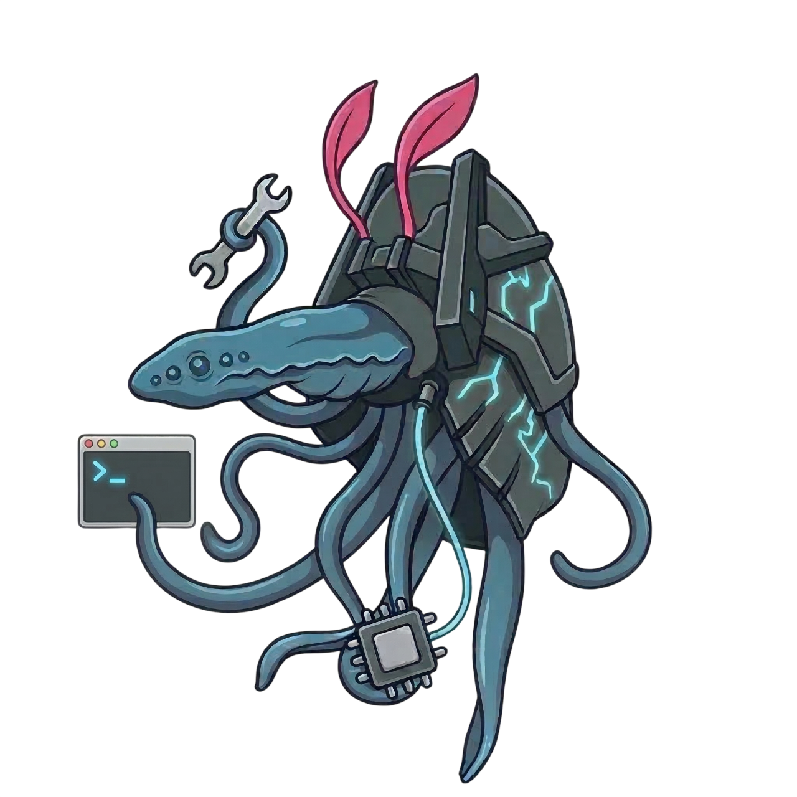

<p align="center">
  
</p>

<h1 align="center">huragok</h1>

<p align="center">
  Describe what you want. Get a 3D model back.<br><br>
  <code>huragok create "sci-fi cargo crate, metal panels, glowing indicators" --output crate.glb</code>
</p>

huragok turns a text description into a textured 3D mesh in under 3 minutes. It generates a concept image with DALL-E 3, sends that image to Hunyuan3D for image-to-mesh conversion, and writes a textured `.glb` you can drop into a glTF viewer or postprocess for game use.

One command, one file out. No modeling skills required.

Named after the <a href="https://www.halopedia.org/Huragok">Huragok</a> (Engineers) from Halo — creatures that fabricate complex objects out of thin air.

---

## Quick start

### 1. Set environment variables

```bash
export HURAGOK_OPENAI_KEY="sk-..."
export HURAGOK_HUNYUAN_SECRET_ID="..."
export HURAGOK_HUNYUAN_SECRET_KEY="..."
```

### 2. Build

```bash
go build ./cmd/huragok/
```

### 3. Run

```bash
./huragok create "futuristic sci-fi cargo crate, metal panels with glowing blue indicators, game prop" --output my_asset.glb
```

The pipeline runs automatically: concept image (~12s) → 3D model (~1-2 min) → `.glb` file.

### Content filter note

OpenAI's DALL-E 3 blocks certain terms. Avoid: "pistol", "gun", "rifle", "weapon". Use instead: "sidearm", "handgun prop", "blaster prop", "energy device", "game asset". The tool retries automatically up to 3 times on content filter false positives. If a prompt is consistently blocked, fall back to `--from <image>` with reference art you provide.

---

## Demo walkthrough

Step-by-step guide for demoing huragok live.

### Before the demo

1. Open a terminal in the huragok project directory
2. Make sure env vars are exported (see Quick start above)
3. Have a browser tab open with [glTF Viewer](https://gltf-viewer.donmccurdy.com/) for showing results
4. Have a browser tab open with the [GitHub repo](https://github.com/jorgoose/huragok) as reference

### Run the demo

**Step 1 — kick off the pipeline.** Type the command and hit enter:

```bash
./huragok create "sci-fi sidearm, compact futuristic handgun prop, sleek angular design, matte gray with blue energy accents, game asset" --output demo_sidearm.glb
```

The audience sees:
```
  ● HURAGOK — 3D Asset Pipeline

  Prompt:  sci-fi sidearm, compact futuristic handgun prop...
  Run:     2026-04-19_134522_a3f8c2

  ▸ Generating concept image... done (13.3s)
    Saved → .huragok/runs/2026-04-19_134522_a3f8c2/concept.png
```

**Step 2 — talk while Hunyuan3D generates (~1-2 min).** Explain what's happening:
- "This is huragok — a Go CLI that wraps the full text-to-3D pipeline into one command"
- "Step 1 just happened — sent the prompt to DALL-E 3 and got a concept image back"
- "Step 2 is running now — that image was sent to Tencent's Hunyuan3D API which generates a textured 3D mesh from it"
- "The tool is designed to be called by AI coding agents — Claude Code can invoke it as a skill to generate game assets on the fly"
- "Built in Go for instant startup and single-binary distribution"

**Step 3 — model lands.** Terminal shows completion:
```
  ▸ Generating 3D model via Hunyuan3D... done (1m5s)
    Raw model: 10.3 MB

  ✓ Output → demo_sidearm.glb (10.3 MB)
```

**Step 4 — show the result.** Drag `demo_sidearm.glb` into the glTF Viewer browser tab. Rotate the model, zoom in, show the textures.

**Step 5 (optional) — show the concept image.** Open the concept image at `.huragok/runs/<run-id>/concept.png` to show the intermediate DALL-E image that produced the 3D model.

### If something goes wrong

- **Content filter blocks the prompt** — the tool auto-retries up to 3 times. If all fail, rephrase using safer terms (see content filter note above) or pass `--from <image>` to skip image generation entirely
- **Hunyuan3D times out** — run it again
- **Billing error** — check that API credits exist on both OpenAI and Tencent Cloud

### Alternative demo prompts

```bash
# Cargo crate
"futuristic sci-fi cargo crate, metal panels with glowing blue indicators, weathered surface, game prop"

# Alien artifact
"ancient alien artifact, glowing runes, crystalline structure, mysterious game prop"

# Military container
"military supply container, olive drab, stenciled markings, industrial game prop"

# Sci-fi helmet
"futuristic combat helmet, angular visor, matte black with blue accents, game asset"
```

---

## How it works

```
  "sci-fi cargo crate"
         │
         ▼
  ┌─────────────┐     ┌─────────────┐
  │   IMAGE     │     │    MODEL    │
  │   generate  │────▶│   generate  │
  │   (DALL-E)  │     │  (Hunyuan)  │
  └─────────────┘     └──────┬──────┘
                             │
                             ▼
                       cargo_crate.glb
                       (textured mesh)
```

Two stages, no checkpoints. The image stage can be skipped with `--from <image>` if you already have reference art.

The output is a textured mesh from Hunyuan3D Rapid — typically ~10 MB, ~48k faces. It's suitable for glTF viewers and as a starting point for further processing (decimation, scale normalization, PBR baking) in your favorite tool. Postprocessing inside huragok is on the roadmap.

---

## Configuration

### Environment variables

| Variable | Required | Purpose |
|---|---|---|
| `HURAGOK_OPENAI_KEY` | when generating from a prompt | OpenAI API key for DALL-E 3 |
| `HURAGOK_HUNYUAN_SECRET_ID` | always | Tencent Cloud SecretId |
| `HURAGOK_HUNYUAN_SECRET_KEY` | always | Tencent Cloud SecretKey |

`HURAGOK_OPENAI_KEY` is not required when using `--from <image>` since the image stage is skipped.

### Run artifacts

Each invocation writes to `.huragok/runs/<run-id>/`:

```
.huragok/runs/2026-04-19_134522_a3f8c2/
├── meta.json          # run ID, timestamps, status, per-stage timing, image source
├── prompt.txt         # the original prompt (empty if --from was used)
├── concept.png        # concept image (from DALL-E or copied from --from)
├── model_raw.glb      # raw Hunyuan3D output
└── model_final.glb    # what was copied to --output (identical to raw today; reserved for postprocessing)
```

The `--output` path receives a copy of `model_final.glb`. Old runs are kept on disk; cleanup is manual for now.

---

## Agent and automation integration

huragok is designed to be invoked headlessly by AI coding agents (Claude Code) and CI pipelines, not just by humans at a terminal.

### Headless mode

```bash
huragok create "cargo crate, sci-fi military" --output static/cargo_crate.glb --json
```

In `--json` mode, stdout receives exactly one JSON object describing the run:

```json
{
  "run_id": "2026-04-19_134522_a3f8c2",
  "status": "complete",
  "stages": {
    "image":   {"status": "complete", "elapsed_ms": 13300},
    "model3d": {"status": "complete", "elapsed_ms": 65200}
  },
  "output": "/abs/path/to/cargo_crate.glb",
  "elapsed_seconds": 78.5
}
```

On failure, `status` is `"failed"` and an `error` envelope is included with `stage` and `message` fields. Pretty terminal output is suppressed in `--json` mode; errors still go to stderr so a human watching can see them.

### Exit codes

| Code | Meaning |
|------|---------|
| 0 | Success |
| 1 | Stage failed (provider error, mesh generation rejected) |
| 2 | Configuration error (missing env var, bad argument, bad `--from` path) |
| 3 | Network/API error (timeout, rate limit, 5xx) — safe to retry |
| 4 | User cancelled (Ctrl+C) |

### Bring your own image

Skip OpenAI entirely and send a reference image straight to Hunyuan3D:

```bash
huragok create --from concept.png --output static/asset.glb --json
```

Halves cost, sidesteps the content filter, and often produces better meshes when you have real concept art.

### Claude Code skill

huragok ships with a Claude Code skill at [`skills/huragok.md`](skills/huragok.md). It teaches Claude when to invoke the CLI, how to parse the JSON output, what each exit code means, and how to work around the DALL-E content filter.

To install:

```bash
mkdir -p .claude/skills
cp skills/huragok.md .claude/skills/
```

Once installed, Claude Code will automatically invoke huragok when the user asks for a 3D model, mesh, or game asset.

---

## CLI reference

```
huragok create [prompt]            Generate a 3D model from a text description
  -o, --output <path>              Output path for the .glb (default: output.glb)
      --from <path>                Use this image instead of generating one with DALL-E
      --json                       Print structured JSON result to stdout
```

Either a prompt argument or `--from` is required. If both are provided, the prompt is ignored with a warning.

---

## Non-goals

The following are explicitly **not** planned. Listed here so the same scope-creep questions don't recur:

- **Maximalist web review UI** (filtering, search, cost dashboard, side-by-side comparison, variant carousel, wireframe toggle, before/after view). For inspecting one model, [glTF Viewer](https://gltf-viewer.donmccurdy.com/) is sufficient. A *minimal* viewer is on the roadmap.
- **Multi-provider abstraction** (Meshy, Tripo, Rodin, Stability). Hunyuan3D is sufficient until proven otherwise. Provider abstractions usually leak; build when there's evidence, not before.
- **Multi-angle / sheet image modes.** Hunyuan3D handles multi-view internally. Generating multiple separate images and combining them produces inconsistent results.
- **Interactive TUI checkpoints** (`[a]ccept [e]dit [r]egenerate [s]kip` boxes). The tool is designed to be agent-callable; an interactive TUI is in tension with that.
- **`--variants n`** generation. Costs n× per call with hand-wavy "pick best" UX.
- **`--pipeline direct` text-to-3D.** Provider-dependent (would require a different provider). Defer.
- **TOML config** (`huragok config`). No knobs to configure yet. Add if and when there are.
- **`--auto` flag.** The CLI is always non-interactive in v0.x. A no-op flag would pretend to support a feature that doesn't exist.

---

## Roadmap

**v0.1 (shipped):**
- [x] Core CLI + image stage (OpenAI DALL-E 3)
- [x] 3D generation stage (Hunyuan3D Rapid via Tencent Cloud)
- [x] Per-run directory layout (`.huragok/runs/<id>/`)
- [x] `--json` headless output
- [x] Categorized exit codes (config / network / stage / cancelled)
- [x] `--from <image>` to skip image generation
- [x] Claude Code skill file

**v0.2 (planned):**
- [ ] `huragok resume <id> --from model3d` — re-run the 3D stage on an existing concept image without paying for DALL-E again
- [ ] Cost tracking + `--max-cost` safety belt for headless callers
- [ ] `huragok runs` and `huragok runs inspect <id>` commands
- [ ] Minimal local viewer (`huragok review`) — list runs, click one to see concept image + 3D preview. No dashboard, no comparison.

**Maybe later:**
- Postprocessing (decimation, scale normalization, PBR bake) — must not break single-binary distribution
- Additional providers — only if Hunyuan3D proves insufficient
